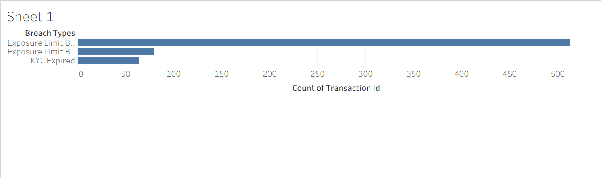
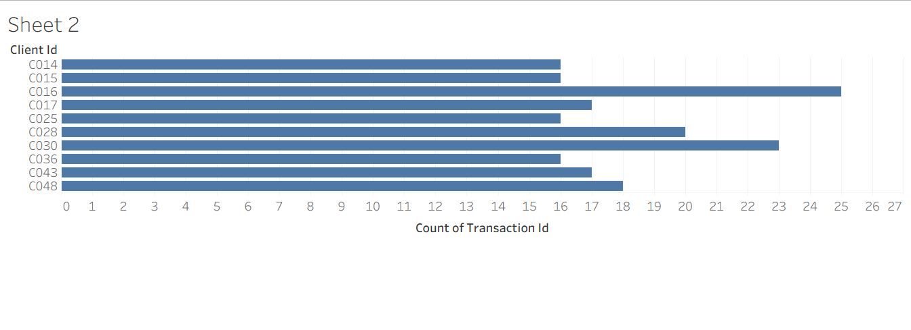
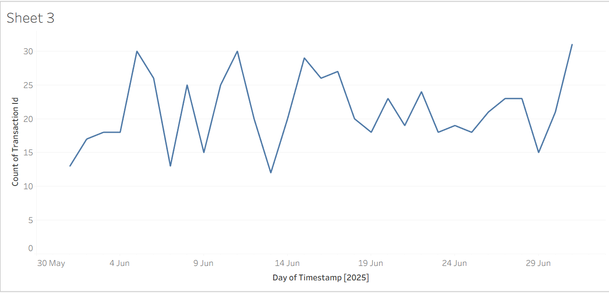

# 🛡️ Compliance Breach Detection & Monitoring Dashboard

An interactive Tableau dashboard to track, visualize, and analyze compliance breaches across clients, breach types, and time. Designed to support proactive risk monitoring, audit preparation, and compliance enforcement.

---

## 🚀 Overview

This dashboard simulates a compliance monitoring system using synthetic transaction data and breach rules (e.g., KYC expiry, exposure limit violations). It provides visual insights to help compliance teams quickly detect high-risk clients, breach trends, and policy violations over time.

---

## 📊 Key Features

| Module                  | Description                                                                 |
|-------------------------|-----------------------------------------------------------------------------|
| 📌 Breach Type Analysis | Shows distribution of compliance violations (e.g., Exposure Limit Breach)   |
| 👤 Top Risky Clients    | Highlights clients with the highest number of breaches                      |
| 📈 Trend Over Time      | Daily timeline showing when breaches peaked or dropped                      |

---

## 📁 Folder Structure

📦 Compliance-Breach-Monitoring
├── 📊 dashboard.twbx
├── 📄 breaches_detected.csv
├── 📄 mock_transactions.csv
├── 📘 README.md
└── 🖼️ assets/
├── 🖼️ sheet1_breach_types.png
├── 🖼️ sheet2_top_clients.png
├── 🖼️ sheet3_trend.png
└── 🖼️ dashboard_full.png

---

## 🖼️ Dashboard Snapshots

### 🔹 Breach Type Distribution

### 🔹 Top 10 Risky Clients

### 🔹 Daily Breach Timeline

### 🔹 Complete Dashboard

---

## 🧠 Sample Insights

- 🔺 75%+ of violations stemmed from `Exposure Limit Breach`
- 👥 Top 10 clients triggered ~40% of total breaches
- 📅 Major compliance spike occurred between 10–14 June

---

## 🧑‍💼 Relevance

This dashboard aligns with **Global Risk & Compliance program** by:
- Demonstrating data-driven risk identification
- Supporting audit trail logging (via optional Python backend)
- Enabling visual governance and early-warning compliance signals

---

## ✅ Future Enhancements

- 🔄 Auto-refresh using Python pipeline + SQLite
- 🚨 Real-time alerts for critical clients
- 🧠 Add ML model to predict breach probability

---

